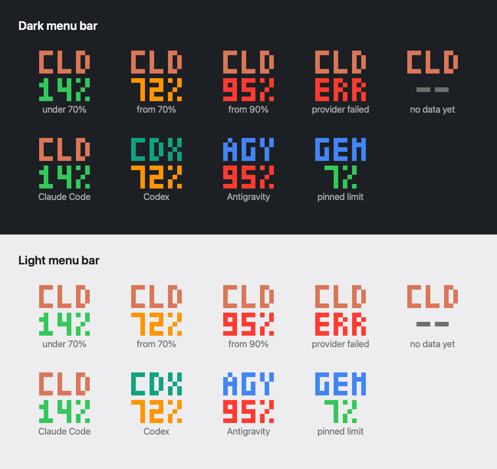
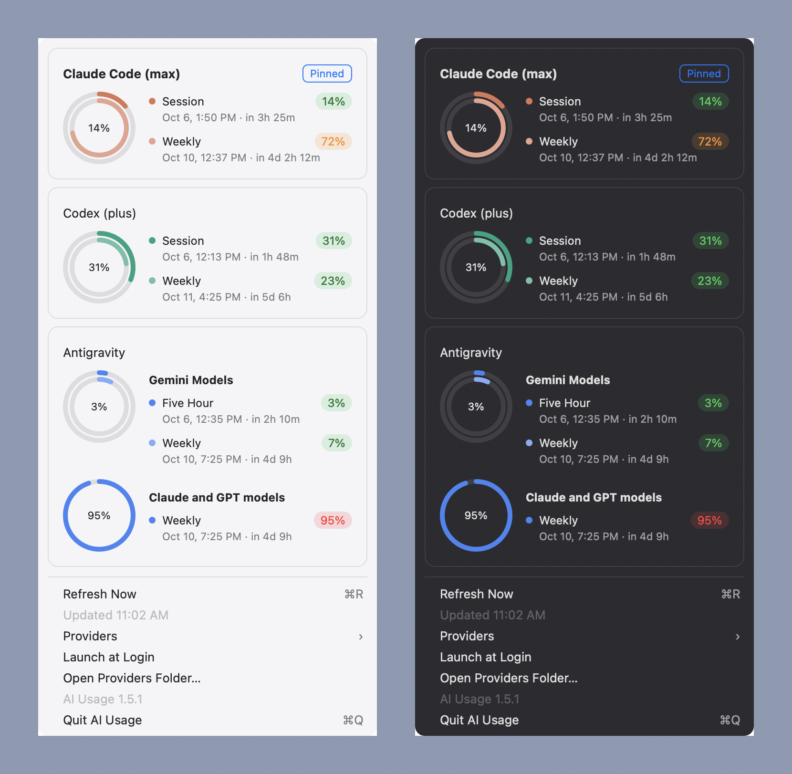

# AI Usage

See how much of your AI coding plans you have left, right in the macOS menu bar.

AI Usage is a small native menu bar app for **Claude Code**, **Codex**, **GitHub Copilot**, and **Antigravity**. It runs each tool's own CLI to read your usage, so it never asks for, reads, or stores a token or password.

- **Glanceable icon.** Two pixel rows: the provider's short name on top, its headline percent below (session limit, else weekly, else premium interactions). Green, orange from 70%, red from 90%.
- **One card per provider.** Concentric rings (session outermost, then weekly) and each limit with its reset time and time left, for example `in 3h 25m` or `in 4d 2h 12m`.
- **Pin what matters.** Hover a card and click **Pin** to put that provider, or a single limit such as one Antigravity model group, on the icon.
- **Multiple Copilot accounts.** Every account `gh` is logged in to is shown, without switching the active one.
- **Hide or turn off.** Hide a card, or switch a provider off so it never runs.
- **Light on resources.** About 11 MB of memory, no Dock icon, no third-party packages, AppKit only.

## The icon at a glance



Top row: the provider (`CLD` Claude Code, `CDX` Codex, `AGY` Antigravity, `GHC` GitHub Copilot) in its brand color, or the first three letters of a pinned limit such as `GEM`. Bottom row: the headline percent, colored by the highest used percent across all the provider's limits. `ERR` means the provider failed; `--` means no data yet.

## The panel



Click the icon to open the panel, one card per provider:

- **Rings.** Concentric rings, session outermost, then weekly. The center shows the headline percent.
- **Rows.** Each limit has a colored percent pill, its reset time in your time zone, and the time left.
- **Groups.** A provider with model groups, like Antigravity, gets one chart per group.
- **Pin, Hide, and order.** Hover a card for **Pin**, **Hide**, and `↑` `↓` arrows that move it. The pinned provider or limit is what the menu bar icon shows. Default order: Claude Code, Codex, Antigravity, Copilot.
- **Menu.** Under the cards: **Refresh Now**, **Providers**, **Launch at Login**, and **Quit**.

## Requirements

- macOS 13 or later.
- The CLIs for the providers you want, logged in: `claude`, `codex`, `gh` (with Copilot), `agy`. Providers whose CLI is missing show the reason in the menu.

## Install

### Homebrew

```
brew install --cask g-akrp/tap/ai-usage
```

Update with `brew upgrade --cask ai-usage`.

### DMG

1. Download `AIUsage-<version>.dmg` from the [latest release](https://github.com/g-akrp/albert-ai-usage/releases/latest).
2. Open it and drag **AI Usage** onto **Applications**.
3. First launch: the app is signed ad hoc, not with a paid Apple Developer ID, so macOS blocks it. Open it once, then go to System Settings › Privacy & Security and choose **Open Anyway**.

To update, quit the app (menu › Quit), install the new DMG over the old app, and open it. The installed version is at the bottom of the menu. To check a download: `shasum -a 256 -c AIUsage-<version>.dmg.sha256`.

### From source

Only the Xcode Command Line Tools are needed.

```
scripts/build-app.sh
open ~/Applications/"AI Usage.app"
```

This builds the app, signs it ad hoc, and copies it to `~/Applications`.

## Use

- Click the icon for the cards. **Refresh Now** (⌘R) reruns every provider.
- **Providers** turns each provider on or off. The choice is kept across launches.
- **Hidden Cards** brings back a card you hid.
- **Launch at Login** starts the app when you log in.
- Each provider refreshes on its own interval (5 minutes; Antigravity 10 minutes). A failing provider retries after 1, 2, 4, … minutes, at most every 30.

Upgrading from older versions:

- Before 1.3.0 the app was called Albert AI Usage (`AlbertAIUsage.app`). Quit and delete it after installing AI Usage; your pin and provider switches carry over. Turn **Launch at Login** on again.
- If you used the SwiftBar plugin, remove its `albert-usage.30s.sh` symlink from SwiftBar's plugin folder.

## Privacy

- Each provider runs as its own CLI, using that CLI's login. AI Usage never reads or stores credentials.
- `GITHUB_TOKEN` and `GH_TOKEN` are never passed to providers, because a stale one shadows a working `gh` login. For Copilot accounts, a token from `gh auth token --user <account>` is set inside that one child process only.
- Nothing is sent anywhere except by the provider CLIs themselves.

## Add or change a provider

A provider is a JSON file, not code: which program to run and how to read its answer. Choose **Open Providers Folder…** in the menu and put a `<id>.json` file in `~/.config/ai-usage/providers/`. A file there with the same id replaces the shipped one. Files are reread on **Refresh Now**, and a file that does not load is listed in the menu with the reason.

The format is the Maestri Agent Usage format, documented in [example/AGENTS.md](example/AGENTS.md), with these additions:

- `iconLabel`: the icon's top row. Default: the first three letters of the id.
- `iconColor`: `"RRGGBB"`. Default: gray.
- `"as": "remainingPercent"` for `used`: 0 to 100 left.
- `match` on a meter or window: the same predicates as `expect`; a value where one fails is skipped. Also `notEquals`.
- `accounts`: run the provider once per account. `source` lists the accounts, `each` points to the list, `id` to each account's name, and an optional `match` filters them. `${account}` in `args` and `env` is replaced by the name.

How providers run:

- Launched directly, without a shell, from an empty temporary folder, in their own process group. Stderr is discarded. On timeout the whole group is killed.
- Minimal environment: `PATH`, `HOME`, `TERM=dumb`, `NO_COLOR=1`, `LANG`, and when set: `USER`, `LOGNAME`, `LC_ALL`, `TMPDIR`, `SHELL`, `SSH_AUTH_SOCK`, `__CF_USER_TEXT_ENCODING`, and the `HTTP(S)_PROXY`, `NO_PROXY`, `ALL_PROXY` variables. Add anything else with `env` in the provider file.
- `PATH` and the proxy variables come from your login shell (`$SHELL -l -i`, read once at launch), then `~/.local/bin`, `~/bin`, `/opt/homebrew/bin`, `/usr/local/bin`, and the system folders. An app opened from Finder does not otherwise see your shell's PATH.
- Output limits from the format are enforced (`maxOutputBytes`, `maxLineBytes`, `maxTotalBytes`).

Where each provider's numbers come from is in [docs/specs/data-source](docs/specs/data-source/data-source.md).

## Contributing

```
swift run CoreChecks          # offline checks; PASS/FAIL per check, non-zero exit on any failure
swift run CoreChecks --live   # runs the shipped providers for real and prints what the menu would show
```

The checks are an executable target, not XCTest, because XCTest does not build with the Command Line Tools alone. Logic lives in `Sources/AIUsageCore/` and gets a check first. Providers are data, so adding or fixing one is a JSON edit. See [AGENTS.md](AGENTS.md) for the rules (AppKit only, no packages, memory under 30 MB).

| Path | What |
|------|------|
| `Sources/AIUsageCore/` | Provider format, mapping, process runner, environment, pixel font, menu model |
| `Sources/AIUsage/` | AppKit shell: `StatusController` (icon, menu), `Poller` (schedule) |
| `Sources/CoreChecks/` | Check runner |
| `Resources/` | `Info.plist`, `AppIcon.icns`, shipped `providers/` |
| `example/` | Maestri's provider format guide and examples |
| `docs/specs/` | Design notes: menu bar, data sources, release |

The two pictures above are drawn from the app's own font, colors, and card view, with sample data:

```
swiftc -parse-as-library -o build/make-showcase Sources/AIUsageCore/*.swift scripts/make-showcase.swift
build/make-showcase
grep -v '^import AIUsageCore$' Sources/AIUsage/CardView.swift > build/CardView.swift
swiftc -parse-as-library -o build/make-panel Sources/AIUsageCore/*.swift build/CardView.swift scripts/make-panel.swift
build/make-panel
```

The app icon is drawn by `scripts/make-icon.swift`; edit it and run `swift scripts/make-icon.swift`. Maintainers: releases are made with `scripts/release.sh`, see [docs/specs/release](docs/specs/release/release.md).
