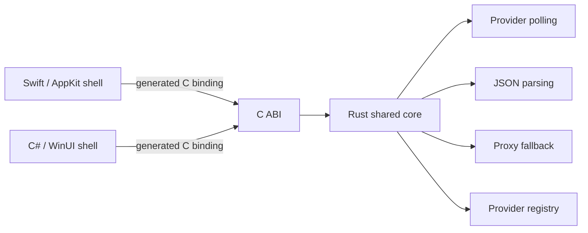

# Application architecture

## Purpose

Provide a small native desktop application for monitoring usage and quota reported by AI coding-agent providers on macOS and Windows. The application polls configured providers, parses their responses, and presents normalized usage information. Provider-specific interfaces, authentication, and product behavior remain subject to later specifications.

## Components and layout

- `core/` — shared Rust business-logic library. Owns provider polling, JSON parsing, proxy fallback, and the provider registry. Exposes a stable C ABI to the UI shells.
- `macos/` — thin native Swift/AppKit shell. Owns macOS presentation and calls the shared core through generated bindings.
- `windows/` — thin native C#/WinUI shell. Owns Windows presentation and calls the shared core through generated bindings.
- `docs/` — repository-owned architecture and ABI specifications.

The shells render core results and translate native user actions into core calls; provider logic belongs in Rust. Complex values cross the C boundary as JSON strings. ABI generation, ownership, and compatibility rules are defined only in [`core-abi.md`](core-abi.md).

## Platform decisions left open

These decisions are intentionally unresolved and require platform-specific design:

- **Credential storage:** choose appropriate secure storage separately for macOS and Windows; this specification does not select a mechanism.
- **Tray/notification area:** determine the native menu-bar/status-item and notification-area conventions, behavior, and presentation for each OS.
- **Launch at login:** decide whether to support it and define the platform-native enablement and lifecycle behavior.

## Constraints

- Use native Swift/AppKit UI on macOS and native C#/WinUI UI on Windows.
- Keep shared business logic in Rust and keep each UI shell thin.
- Do not use Electron, Tauri, Wails, or any other cross-platform GUI framework.
- Keep shell/core coupling behind the generated C ABI; see [`core-abi.md`](core-abi.md).
