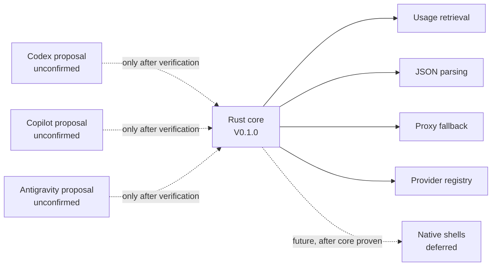
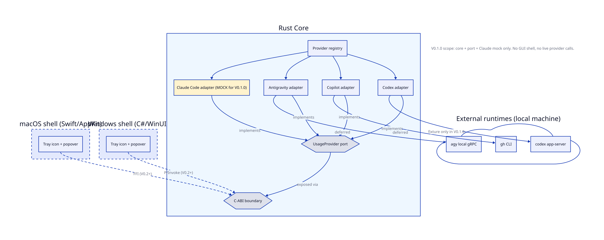

# Application architecture

## Purpose

Albert AI Usage is intended to monitor usage and quota reported by AI coding-agent providers. V0.1.0 is deliberately limited to proving the shared Rust core; it does not include a desktop UI or provider-specific implementation contracts.

## V0.1.0 scope

- `core/` — Rust library whose V0.1.0 purpose is usage retrieval for Codex, Copilot, and Antigravity only after each provider has a separately verified source contract. The core owns provider polling, JSON parsing, proxy fallback, and the provider registry.
- `docs/` — architecture, ABI, and research-grade provider-source proposals.

The intended initial provider set is Codex, Copilot, and Antigravity, subject to future verified source contracts; no usage retrieval is approved against an unverified proposal. Claude Code is explicitly **Unsupported** because no local non-interactive usage source exists, and TUI scraping is forbidden. Proposed sources and their confidence are recorded in [`provider-source-proposals.md`](provider-source-proposals.md); none is a verified implementation contract.

## Deferred desktop shells

macOS Swift/AppKit and Windows C#/WinUI shells, their layouts, and their OS-specific UX decisions are deferred until the Rust core is proven and shell work is separately approved. Do not create or include either shell or shell layout in V0.1.0. When resumed, the intended shells remain native; no cross-platform GUI framework is in scope.

OS-specific credential storage, menu-bar/tray and notification-area conventions, and launch-at-login behavior remain open decisions for the later shell design.

## Core relationships

The future shell boundary is documented in [`core-abi.md`](core-abi.md), but V0.1.0 has no shell target or shell implementation.

## Diagram

Full component diagram, D2 source at [`architecture.d2`](architecture.d2), rendered to [`architecture.svg`](architecture.svg):

